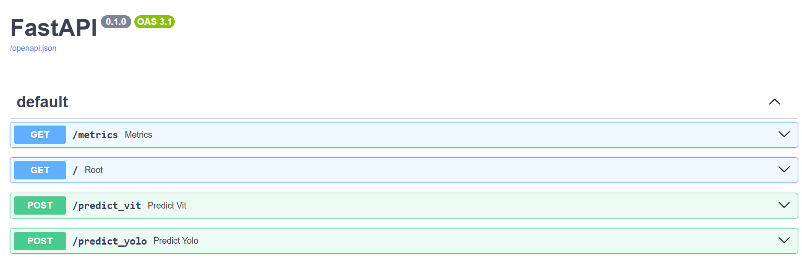
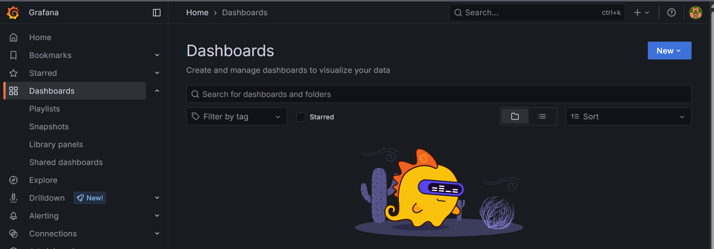

This repository simulates a real-world MLOps pipeline combining image classification (Vision Transformer via HuggingFace) and object detection (YOLOv8 via Ultralytics).

It covers full production-style automation: training, CI/CD, model versioning, inference APIs, centralized config, monitoring, and cloud model storage.

Features
Modular training scripts for classification and detection

train_vit.py, train_yolov8.py

CLI arguments for dataset paths, hyperparameters, and optional S3 upload

Unified FastAPI server with /predict_vit and /predict_yolo endpoints

Docker Compose setup for API, Prometheus, and Grafana

Unified CLI prediction script with auto task detection

MLflow tracking with S3 model upload

GitHub Actions CI/CD pipelines for auto-training

Prometheus metrics via /metrics endpoint

Grafana dashboard support

Centralized .env for config like SERVER_URL

Folder Structure
bash
Copy
Edit
.
├── app/                  # FastAPI inference server
├── client/               # CLI for predictions
├── vit-data/, yolo-data/ # Sample datasets
├── models/               # S3-uploaded model artifacts (ignored by Git)
├── outputs/              # Prediction logs, metrics (ignored by Git)
├── metrics/              # Confusion matrix, visual outputs (ignored)
├── .github/workflows/    # GitHub Actions CI/CD YAMLs
├── docker-compose.yml    # Docker Compose config
├── prometheus.yml        # Prometheus scrape config
├── requirements.txt
├── .env                  # Centralized variables (ignored by Git)
├── train_vit.py
├── train_yolov8.py
├── client_predict.py     # Unified prediction script
└── README.md
Quick Start
1. Training
bash
Copy
Edit
python train_vit.py --train_dir vit-data/train --val_dir vit-data/val --epochs 1 --upload_s3 True
python train_yolov8.py --data yolo-data/data.yaml --epochs 1 --upload_s3 True
2. Inference (Locally)
bash
Copy
Edit
uvicorn inference_server:app --host 0.0.0.0 --port 8000
Or via Docker:

bash
Copy
Edit
docker-compose up --build
3. Prediction
Edit .env:

ini
Copy
Edit
SERVER_URL=http://<EXTERNAL_IP>:8000
Run:

bash
Copy
Edit
python client_predict.py --image dog.jpg
Monitoring (Prometheus + Grafana)
Visit http://<EXTERNAL_IP>:9090 for Prometheus UI

Visit http://<EXTERNAL_IP>:3000 for Grafana UI

Prometheus scrapes /metrics from the FastAPI container

Metrics include: request counts, durations, memory usage, etc.

CI/CD Automation
GitHub Actions workflows (.github/workflows/) automatically:

Trigger training on push

Upload model and metrics to S3

Track runs via MLflow

Ensure AWS credentials are set in GitHub Secrets:

nginx
Copy
Edit
AWS_ACCESS_KEY_ID
AWS_SECRET_ACCESS_KEY
API Reference
Swagger UI: http://<EXTERNAL_IP>:8000/docs

/predict_vit: Image classification

/predict_yolo: Object detection

/metrics: Prometheus scrape endpoint

### 🧪 CLI Prediction Demo

```bash
python client_predict.py vit-data/val/dog/dog9.jpg

[INFO] Using endpoint: /predict_vit

=== PREDICTION RESULT ===
{
  "model": "ViT",
  "predicted_class": "airplane",
  "confidence": 0.6795
}


### 📄 Swagger UI




### 📈 Grafana Monitoring



Notes
This is a Level 2++ MLOps demonstration project with full training → deployment → monitoring cycle. It replicates industry best practices while remaining
lightweight and educational.

Last updated: 2025-06-26
